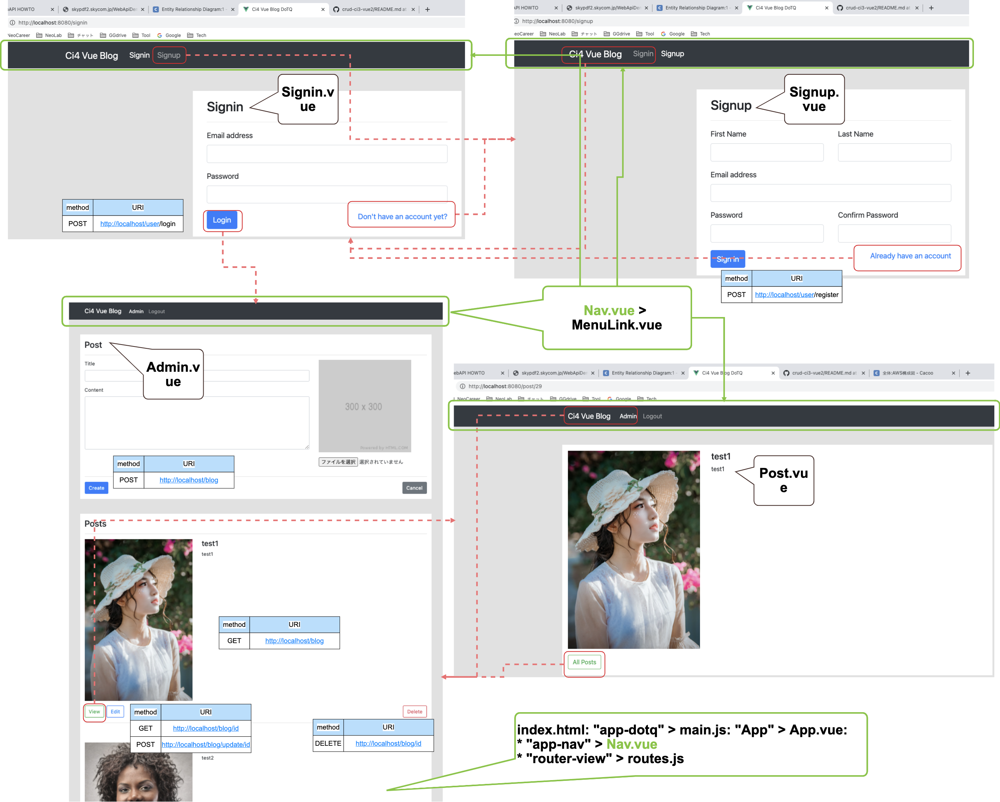

# Running local
```
  project% docker-compose up -d
  project% cd ci4-vue-blog
  ci4-vue-blog % npm run serve
```

* access "http://localhost:8080/"
* choose file:
> copy FROM `ci4-vue-blog/src/assets` TO `www/codeigniter4/public/assets/uploads`
